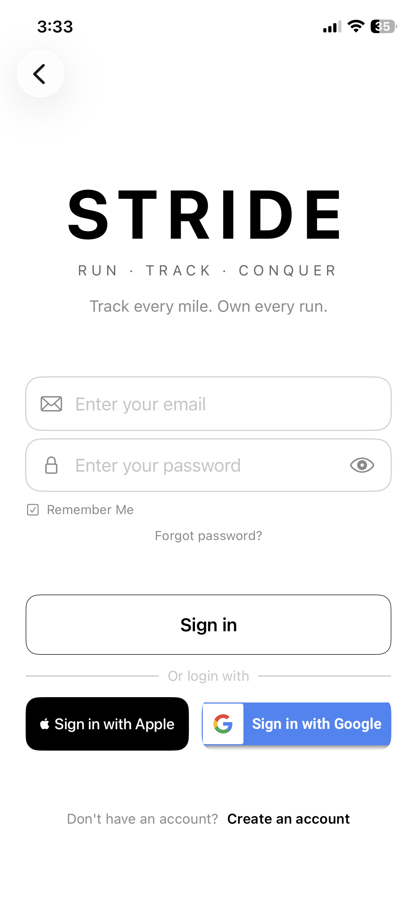
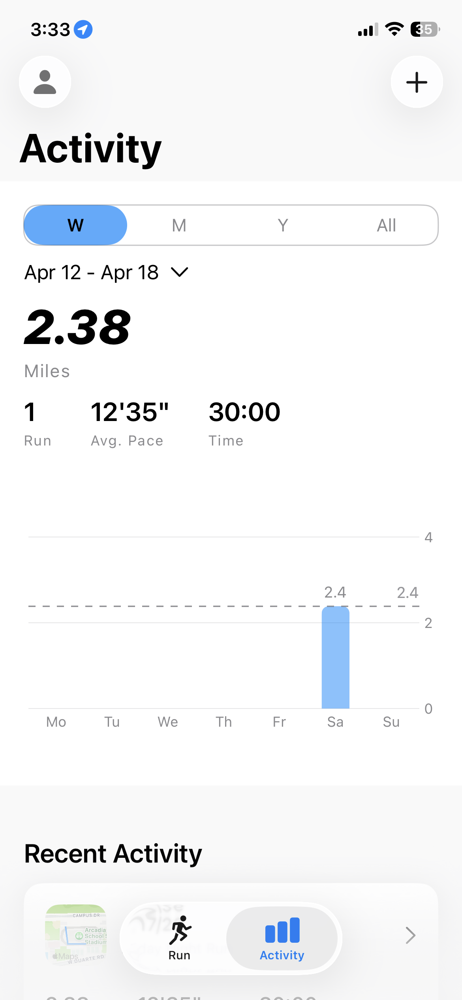

# NRC Clone

A full-stack Nike Run Club clone. Built as a portfolio project to demonstrate end-to-end iOS development — from GPS tracking and SwiftUI to a REST API backend with Firebase Auth.

> **iOS repo**: [stride-ios](https://github.com/kkennethsieu/stride-ios)  
> **Backend repo**: [stride-backend](https://github.com/kkennethsieu/stride-backend)

---

<p align="center">
  
</p>

---

## Demo

<p align="center">
  
  &nbsp;&nbsp;
  
  &nbsp;&nbsp;
  
  &nbsp;&nbsp;
  
  &nbsp;&nbsp;
  
</p>

---

## Features

- Live GPS run tracking — pace, distance, elevation, per-mile splits
- Run history with route map previews and charts
- Sign in with Apple and Google via Firebase Auth
- Full backend sync — runs stored in Firestore via a Node.js/Express API
- SwiftData offline-first persistence
- Photo capture, HealthKit integration, local notifications
- Custom-filmed onboarding video

---

## Stack

### iOS
| | |
|---|---|
| Language | Swift |
| UI | SwiftUI |
| Persistence | SwiftData |
| Location | CoreLocation |
| Maps | MapKit |
| Charts | Swift Charts |
| Auth | Firebase Auth (Apple + Google Sign-In) |
| Health | HealthKit |

### Backend
| | |
|---|---|
| Runtime | Node.js |
| Framework | Express |
| Database | Cloud Firestore |
| Auth | Firebase Admin SDK |

---

## How It Works

```
iPhone
  └── SwiftUI + SwiftData (offline-first)
        └── URLSession → REST API
              └── Express + Firebase Admin
                    └── Cloud Firestore
```

The iOS app stores runs locally in SwiftData and syncs to the backend on save. Firebase Auth issues ID tokens on the client — the backend verifies every request using Firebase Admin SDK. All run queries are scoped to the authenticated user.

---

## Repos

| Repo | Description |
|---|---|
| [stride-ios](https://github.com/kkennethsieu/stride-ios) | SwiftUI app — tracking, history, auth, HealthKit |
| [stride-backend](https://github.com/kkennethsieu/stride-backend) | Node.js/Express API — Firestore CRUD, auth middleware |
